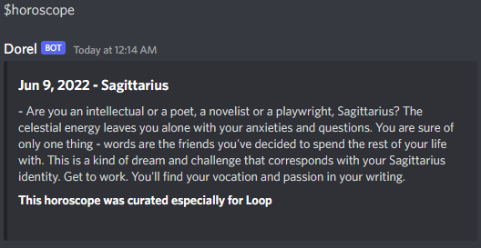

# Discordel

A highly advanced discord bot that can help you do your homework using stackoverflow or entertain you with some nice insights about your astrological profile.

## Authors

- [Teodor Lupu](https://github.com/luputeodor2)
- [Robert Pinzaru](https://github.com/rbrtp12)

## Features

You can use $info if you want to see all the available commands Dorel shall handle for you. Here's a list of all the cool stuff our lovely bot can do:

- He can tell you all the available commands but we just told you that.
- He can say hi! Although it's in Romanian slang... and you gotta say $salut first
- He can show you your horoscope! He'll remember your zodiac sign if you selected it by reacting on the private message he sent you and he will look up what today's got in store for you.
- He can show you any horoscope! All you have to do let him know the zodiac sign you want to find out more about.
- He can even send you your horoscope daily! You just gotta $subscribe to his horoscope newsletter. (ok this one ain't ready just yet, you know the struggle, so we decided to do nothing when you $subscribe, at least for now)
- He can look something up on stackoverflow! This one is especially helpful for those classes you're just not quite sure if you're going to make it till the end. (Trust me, you can!)
- He can learn new stuff! The only thing here is you actually have to talk to one of the [authors](https://github.com/luputeodor2/discordel#authors) and it's probably gonna take a while before your wish comes true...
## Deployment

The whole app and its database lives safe and sound in the warm hands of [Heroku](https://dashboard.heroku.com/apps/discordel), so all you have to do in order to enjoy it is to find a server where our bot is waiting for you.

In order to deploy the application to Heroku we had to create a Docker image and use a Yaml file to tell our host what to do with it. Also, we used a ClearDB plugin to create a cloud-based database where all the information is stored and waiting to be accesed by our bot.

## Screenshots

